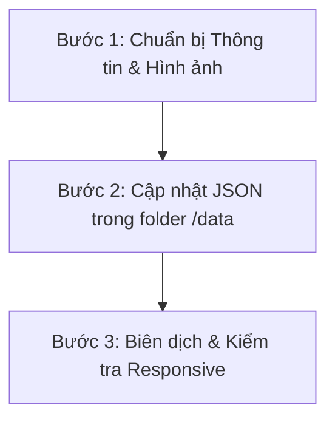

# Nguyễn Hồng Loan - Portfolio | Biên Tập Viên Thế Hệ Mới


## 📌 Giới Thiệu Chung

Đây là dự án **Portfolio Cá Nhân & Hồ Sơ Năng Lực (CV)** của **Nguyễn Hồng Loan** – Sinh viên ngành Truyền thông Đa phương tiện (Học viện Phụ nữ Việt Nam) và hiện là **Cộng tác viên Biên tập viên VTV**.

* **Persona**: Nguyễn Hồng Loan - Biên tập viên Truyền hình & Sáng tạo nội dung Đa phương tiện.
* **Core Concept**: *"Biên tập viên thế hệ mới"* – Sự giao thoa giữa **Văn hóa truyền thống** (nghiên cứu học thuật, báo chí chuẩn mực) và **Truyền thông số/Đa phương tiện** (tư duy nội dung ngắn viral, thuật toán TikTok/Reels, vlogs cinematic).
* **Tone & Voice**: Chuyên nghiệp, sáng tạo, truyền cảm hứng nhưng giữ vững sự chuẩn mực của ngành Báo chí - Truyền hình.

---

## 🌟 Điểm Nổi Bật & Thành Tích

* 🏆 **Giải Nhất Nghiên cứu Khoa học Sinh viên cấp Học viện (2025)**: Đề tài về văn hóa truyền thống, khẳng định năng lực nghiên cứu và tư duy học thuật.
* 🎓 **Học vấn xuất sắc**: GPA **3.42 / 4.0** (Xếp loại Giỏi) - Ngành Truyền thông Đa phương tiện, Học viện Phụ nữ Việt Nam.
* 🌐 **Ngoại ngữ**: Chứng chỉ Tiếng Anh **IELTS B2**, có khả năng nghiên cứu và khai thác tư liệu báo chí quốc tế.
* 📺 **Kinh nghiệm báo chí truyền hình**: Từng thực tập tại **Đài Phát thanh & Truyền hình Bắc Giang** (nay là Đài PT&TH Bắc Ninh), trực tiếp tác nghiệp ảnh hiện trường, dựng phóng sự và phỏng vấn nhân vật.
* 🚀 **Sáng tạo nội dung số**: 
  * Kênh TikTok cá nhân & các kênh văn hóa thu hút **20K+ Followers**, **1.5M+ Likes**.
  * Dựng video tiếp thị thị trường cho thương hiệu thể thao đạt **Top 3 doanh thu ngành hàng Pickleball** trên TikTok Shop.

---

## 🛠️ Công Nghệ Sử Dụng trong Dự Án

Ứng dụng được xây dựng trên nền tảng Web hiện đại, tối ưu hiệu năng và trải nghiệm người dùng:

* **Frontend Framework**: React 18 + Vite + TypeScript.
* **Styling & UI**: Tailwind CSS (v4) + Lucide Icons.
* **Thiết kế Responsive**: Tối ưu hoàn hảo cho mọi kích thước màn hình (Desktop, Tablet, Mobile).
* **Kiến trúc Dữ liệu Tĩnh**: Tách biệt dữ liệu cấu trúc JSON và mã nguồn hiển thị giúp dễ dàng quản lý và cập nhật nội dung.

---

## 📂 Cấu Trúc Thư Mục Dự Án

```text
nguyen-hong-loan-portfolio/
├── data/                      # Dữ liệu tĩnh cấu hình thông tin cá nhân & dự án
│   ├── page-data.json         # Thông tin cá nhân, học vấn, kỹ năng, kinh nghiệm
│   └── work-data.json         # Danh sách tác phẩm & dự án tiêu biểu
├── public/
│   └── images/                # Hình ảnh dự án, logo, chân dung & biểu tượng
│       ├── home/              # Banner, vector trang chủ, kỹ năng
│       ├── icon/              # Các icon truyền thông & mạng xã hội
│       ├── logo/              # Logo thương hiệu cá nhân
│       └── work/              # Hình ảnh minh họa dự án
├── src/
│   ├── App.tsx                # Giao diện chính của ứng dụng
│   ├── index.css              # Cấu hình Tailwind CSS & tùy chỉnh giao diện
│   └── main.tsx               # Entry point ứng dụng React
├── index.html                 # File HTML gốc
├── metadata.json              # Thông tin ứng dụng AI Studio
├── package.json               # Quản lý dependencies & scripts
├── tsconfig.json              # Cấu hình TypeScript
└── vite.config.ts             # Cấu hình Vite bundler
```

---

## 📋 Hướng Dẫn Cập Nhật Portfolio (Workflow)

Mọi cập nhật thông tin cá nhân hoặc bổ sung tác phẩm mới thực hiện theo quy trình 3 bước:



1. **Thêm dữ liệu vào `data/page-data.json` hoặc `data/work-data.json`**:
   * **Projects**: Bổ sung tên dự án, vai trò, đường dẫn hình ảnh (`/images/work/...`), liên kết xem trực tiếp (Google Drive / TikTok / YouTube / Facebook).
   * **Hình ảnh**: Đặt ảnh mới trong thư mục `/images/work/` tương ứng.
2. **Kiểm tra hiển thị**:
   * Đảm bảo định dạng văn bản dài giữ dấu xuống dòng `\n\n` để đảm bảo phân đoạn đẹp trên giao diện.
   * Linter & Compiler sẽ tự động xác minh tính hợp lệ của mã nguồn.

---

## 🚀 Hướng Dẫn Triển Khai Lên GitHub Pages (Tự Động)

Dự án đã được tích hợp sẵn **GitHub Actions Workflow** tự động build và deploy lên GitHub Pages mỗi khi bạn push code lên GitHub:

### Cách kích hoạt trên GitHub:
1. Vào repository của bạn trên GitHub (ví dụ: `hongloanvwa.github.io` hoặc `Nguyen_Hong_loan`).
2. Nhấn vào tab **Settings** (Cài đặt) ở thanh menu trên cùng của repository.
3. Ở menu bên trái, chọn **Pages**.
4. Tại phần **Build and deployment**:
   - Ở mục **Source**, chọn **GitHub Actions** (thay vì *Deploy from a branch*).
5. Sau khi chọn, GitHub sẽ tự động chạy quy trình build và deploy trang web của bạn lên link `https://hongloanvwa.github.io/`.
6. Chờ khoảng 1–2 phút, tải lại trang là website sẽ hiển thị đầy đủ giao diện, hình ảnh và video!

---

## 💻 Hướng Dẫn Chạy Dự Án Chế Độ Local (Development)

1. **Cài đặt phụ thuộc (Dependencies)**:
   ```bash
   npm install
   ```

2. **Chạy Dev Server**:
   ```bash
   npm run dev
   ```
   Ứng dụng sẽ chạy tại địa chỉ: `http://localhost:3000`

3. **Kiểm tra Build Sản Phẩm**:
   ```bash
   npm run build
   ```

---

## 📞 Thông Tin Liên Hệ & Tương Tác

* 📧 **Email**: hongloanvwa@gmail.com
* 📱 **Điện thoại / Zalo**: +84 369 608 516
* 🎵 **TikTok Cá Nhân**: [@nghongloan](https://www.tiktok.com/@nghongloan)
* 📚 **TikTok Dự Án Văn Học**: [@chuyen.hoc.van](https://www.tiktok.com/@chuyen.hoc.van)
* 👘 **TikTok Dự Án Cổ Phục**: [@moiphoxuaao](https://www.tiktok.com/@moiphoxuaao)
* 🔴 **YouTube**: [@onlyelse](https://www.youtube.com/@onlyelse)

---
*© 2026 Nguyễn Hồng Loan. All rights reserved.*
